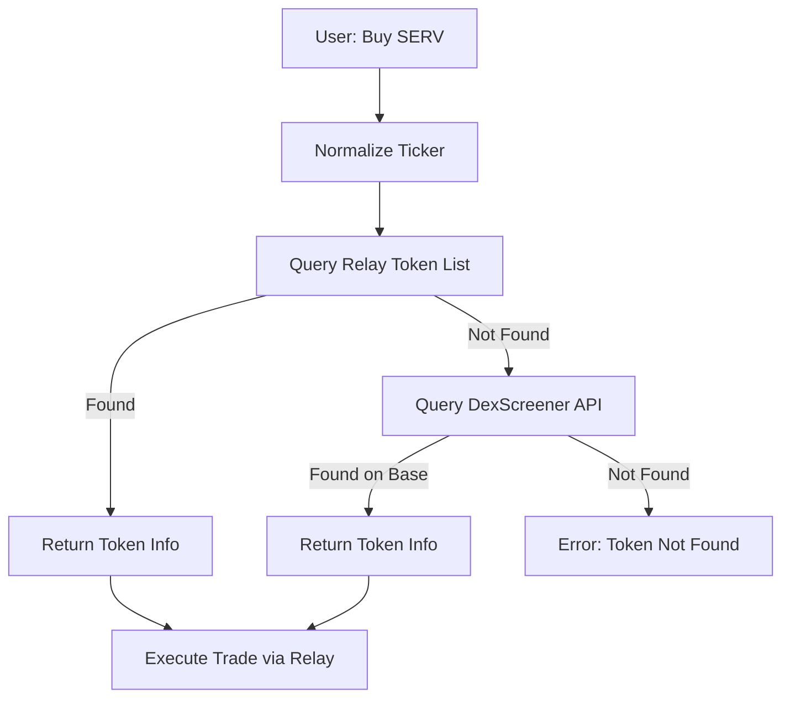

# Relay Protocol Trading Agent

An OpenServ agent for executing token swaps on Base chain using Relay Protocol.

## Features

- 🔄 **Token Swaps**: Buy any token on Base with ETH or USDC
- 🎯 **Intelligent Ticker Resolution**: Automatically resolves tickers like "$SERV" to contract addresses
- 🔐 **Secure Credentials**: Fetches private keys from OpenServ secrets
- 🌐 **Relay Protocol**: Best execution across DEXs on Base
- 💡 **Natural Language**: Trade using simple commands like "Buy 0.1 ETH worth of DEGEN"

## How It Works

The agent uses a **hybrid ticker resolution** system:

1. **Primary**: Queries Relay Protocol's token list for major/verified tokens
2. **Fallback**: Queries DexScreener for new/meme tokens not yet in Relay's list
3. **Execution**: Routes trades through Relay Protocol for best prices

## Setup

### 1. Install Dependencies

```bash
cd relay-protocol-agent
npm install
```

### 2. Configure Environment Variables

Create a `.env` file:

```bash
# Required
OPENSERV_API_KEY=your_openserv_api_key_here

# Optional
PORT=7380
BASE_RPC_URL=https://mainnet.base.org
```

### 3. Configure OpenServ Secrets

In your OpenServ workspace, add a secret containing your Base wallet private key:

#### Example Secret Names:

- **relay_key**: Your Base wallet private key (e.g., `0xabc123...`)
- **base_wallet**: Alternative naming
- **BASE_PRIVATE_KEY**: Another option

**Important**: You can use **any secret name** you want! Just reference it in the `pk_name` parameter when trading.

⚠️ **Security**: Your wallet needs ETH on Base for gas fees. The agent will never expose your private key.

## Running the Agent

```bash
npm start
```

The agent will start on port **7380** (or the port you specify in `.env`).

## Expose Locally with ngrok

If you want to access your local agent from the internet:

1. Install ngrok:

```bash
# macOS (Homebrew)
brew install ngrok/ngrok/ngrok

# Or download from ngrok.com
```

2. Authenticate with ngrok (optional but recommended):

```bash
ngrok config add-authtoken <your_ngrok_authtoken>
```

3. Start a tunnel:

```bash
ngrok http 7380
```

4. Use the public URL (e.g., `https://<id>.ngrok-free.app`) to call your endpoints.

## Capabilities

### `trade_token`

Swaps ETH or USDC for any token on Base chain.

**Parameters:**

- `ticker` (string): Token symbol to buy (e.g., "SERV", "DEGEN", "$BRETT")
- `amount` (string): Amount of ETH or USDC to spend (e.g., "0.1", "10")
- `inputCurrency` (enum): "ETH" or "USDC"
- `slippage` (string, optional): Slippage tolerance percentage (default: "2")
- `pk_name` (string): Secret name containing the private key (e.g., "relay_key")

**Example - Direct POST:**

```bash
curl -X POST http://localhost:7380/tools/trade_token \
  -H 'Content-Type: application/json' \
  -d '{
    "args": {
      "ticker": "DEGEN",
      "amount": "0.1",
      "inputCurrency": "ETH",
      "slippage": "2",
      "pk_name": "relay_key"
    }
  }'
```

**Example - OpenServ Trigger:**

```json
{
  "event": {
    "ticker": "SERV",
    "amount": "0.05",
    "inputCurrency": "ETH",
    "pk_name": "base_wallet"
  },
  "summary": "Buy SERV with 0.05 ETH"
}
```

### `test`

Simple test capability to verify the agent is working.

```bash
curl -X POST http://localhost:7380/tools/test \
  -H 'Content-Type: application/json' \
  -d '{"args": {"message": "Hello Relay Protocol"}}'
```

## Trade Examples

### Buy Major Token (DEGEN on Base)

Uses Relay Protocol's verified token list:

```json
{
  "ticker": "DEGEN",
  "amount": "0.1",
  "inputCurrency": "ETH",
  "pk_name": "relay_key"
}
```

### Buy Meme Token with USDC

Falls back to DexScreener if not in Relay's list:

```json
{
  "ticker": "$BRETT",
  "amount": "10",
  "inputCurrency": "USDC",
  "slippage": "3",
  "pk_name": "relay_key"
}
```

### Buy with Custom Slippage

Higher slippage for volatile tokens:

```json
{
  "ticker": "BASED",
  "amount": "0.05",
  "inputCurrency": "ETH",
  "slippage": "5",
  "pk_name": "relay_key"
}
```

## How Ticker Resolution Works



**Supported Ticker Formats:**

- `SERV` - Plain symbol
- `$SERV` - With dollar sign (automatically stripped)
- `serv` - Case insensitive

## Trade Execution Flow

1. **Fetch Credentials**: Retrieves private key from OpenServ secrets
2. **Initialize Wallet**: Creates viem wallet client for Base chain
3. **Resolve Ticker**: Finds token contract address using hybrid resolver
4. **Get Quote**: Queries Relay Protocol for best swap route
5. **Execute Swap**: Signs and submits transaction on Base
6. **Return Result**: Provides transaction hash and explorer link

## Base Chain Information

- **Chain ID**: 8453
- **Chain Name**: Base
- **Native Currency**: ETH
- **USDC Address**: `0x833589fCD6eDb6E08f4c7C32D4f71b54bdA02913`
- **Block Explorer**: https://basescan.org

## Multiple Wallets

The agent supports **dynamic wallet selection** via the `pk_name` parameter:

1. Add multiple secrets in your OpenServ workspace:
   - `relay_wallet_1` - Your primary trading wallet
   - `relay_wallet_2` - Your secondary wallet
   - `test_wallet` - Your testnet wallet
2. Pass the secret name in `pk_name` when trading

If you specify a secret name that doesn't exist, you'll get a helpful error listing all available secrets.

## Security Notes

- **Never expose your private key** - always store it in OpenServ secrets
- Your wallet needs **ETH on Base** for gas fees
- Start with **small amounts** to test
- Use appropriate **slippage tolerance** (2-5% recommended)
- The agent only has access to secrets you explicitly add to your OpenServ workspace

## Troubleshooting

### "Could not find token address"

- Check ticker spelling (e.g., "DEGEN" not "degen")
- Verify the token exists on Base chain
- Try with `$` prefix: `$SERV`

### "Insufficient balance"

- Add ETH to your Base wallet for gas
- Ensure you have enough ETH or USDC for the swap amount

### "Quote or execution failed"

- Increase slippage tolerance (volatile tokens need 3-5%)
- Check that the token has sufficient liquidity on Base
- Verify your wallet has ETH for gas

### "Secret not found"

- Check the secret name in your OpenServ workspace
- Ensure the secret contains a valid private key starting with `0x`
- The error will list all available secret names

## Supported Tokens

**Major Tokens** (via Relay Protocol list):

- ETH (native)
- USDC, USDT
- WETH, cbETH
- And many more...

**New/Meme Tokens** (via DexScreener fallback):

- DEGEN
- BRETT
- TOSHI
- And thousands more...

If a token is tradeable on Base DEXs, this agent can likely find and trade it!

## Learn More

- [Relay Protocol Docs](https://docs.relay.link/)
- [Relay Protocol SDK](https://docs.relay.link/references/sdk/getting-started)
- [Base Chain](https://base.org/)
- [OpenServ Platform](https://openserv.ai/)
- [DexScreener API](https://docs.dexscreener.com/)

## Architecture

The agent uses a **modular capability system**:

```
relay-protocol-agent/
├── agent-server.ts          # Main server and agent initialization
├── capabilities/
│   ├── index.ts            # Capability registry
│   ├── test.ts             # Test capability
│   ├── trade.ts            # Main trading capability
│   └── utils/
│       ├── relay-client.ts     # Relay Protocol client setup
│       └── ticker-resolver.ts  # Ticker resolution logic
├── types/
│   └── capability.ts       # Shared types
└── package.json            # Dependencies
```

## Development

### Adding New Capabilities

1. Create a new file in `capabilities/`
2. Export a `create[Name]Capability` function
3. Register it in `capabilities/index.ts`

See `capabilities/test.ts` for a simple example.

### Testing Locally

#### Option 1: Quick Quote Testing (No Server Required)

Test ticker resolution and get quotes without starting the full agent server:

```bash
npx tsx test-capability.ts
```

This will:

- ✅ Resolve token tickers (BRETT, KUDAI, SERV, etc.)
- ✅ Fetch real quotes from Relay Protocol
- ✅ Show clean output with rates, price impact, and gas fees
- ✅ No wallet or secrets needed (uses dummy addresses)

**Edit test tokens:**
Modify `TEST_CASES` in `test-capability.ts` to test different tokens.

#### Option 2: Full Server Testing

```bash
# Start the agent
npm start

# In another terminal, test with curl
curl -X POST http://localhost:7380/tools/test \
  -H 'Content-Type: application/json' \
  -d '{"args": {"ticker": "DEGEN"}}'
```

## License

ISC
